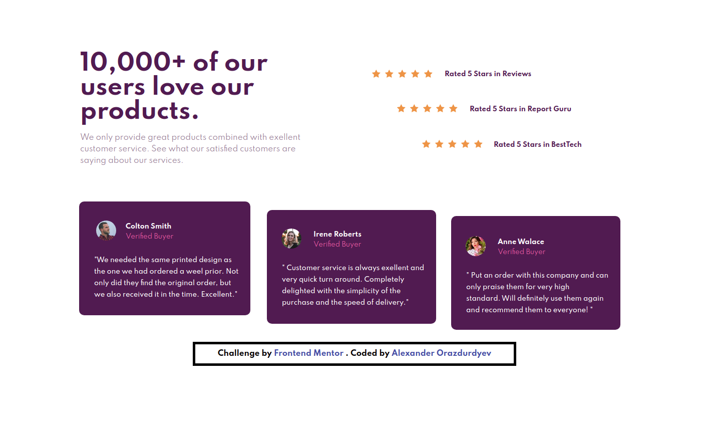

# Frontend Mentor - Social proof section solution

This is a solution to the [Social proof section challenge on Frontend Mentor](https://www.frontendmentor.io/challenges/social-proof-section-6e0qTv_bA). Frontend Mentor challenges help you improve your coding skills by building realistic projects. 

## Table of contents

- [Overview](#overview)
  - [Screenshot](#screenshot)
  - [Links](#links)
- [My process](#my-process)
  - [Built with](#built-with)
  - [What I learned](#what-i-learned)
  - [Continued development](#continued-development)
- [Author](#author)

## Overview

### Screenshot

### Links

- Solution URL: [Add solution URL here](https://your-solution-url.com)
- Live Site URL: [Vercel](https://social-proof-section-snowy-two.vercel.app/)

## My process

### Built with

- Semantic HTML5 markup
- CSS custom properties
- ["Spartan" Google fonts](https://fonts.google.com/specimen/Spartan?preview.text_type=custom) - For styles

### What I learned

I learned how to do a social proof section 

### Continued development

I still need to learn more about how to make the site responsive for mobile devices 

## Author

- Website - [IcEWaRRiOr](https://icewarriorblog.wordpress.com)
- Frontend Mentor - [@IcEWaRRiOr01](https://www.frontendmentor.io/profile/IcEWaRRiOr01/)
